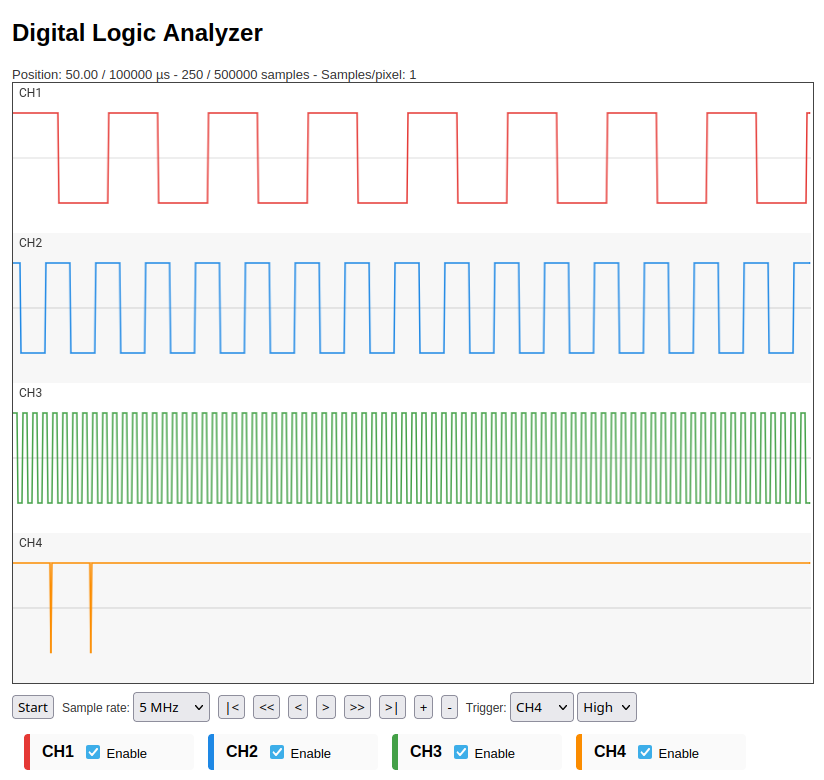

# README

This program samples the input level of GPIO21-24 (4 channels) with a rate of up to 20 MHz using the PIO device of the Raspberry Pi 5 and shows the resulting waveforms in a web frontend. You have to open the IP address, which is displayed on screen, in your web browser on another computer in your local network.

When you connect GPIO4/5/6 (GP0/1/2 clock outputs) with GPIO21/22/23, you will see square wave signals with different frequencies. Channel 4 was used here as trigger for a button, connected between GPIO24 and 3.3V. You can see the button bouncing:

This example program is not perfect. It shows a possible use of the PIO, but has limitations in some functions. Especially there is a problem with higher sample rates. While PIO is able to sample at 200 MHz, the currently available DMA bandwidth does not meet this. It is not clear, by how far this bandwith can be increased with an optimized configuration of the DMA controller and of PIO in Circle. Also the DMA is started after the PIO state machine, so the FIFO may overrun early with higher sample rates. DMA recovers from this quickly in a capture.
